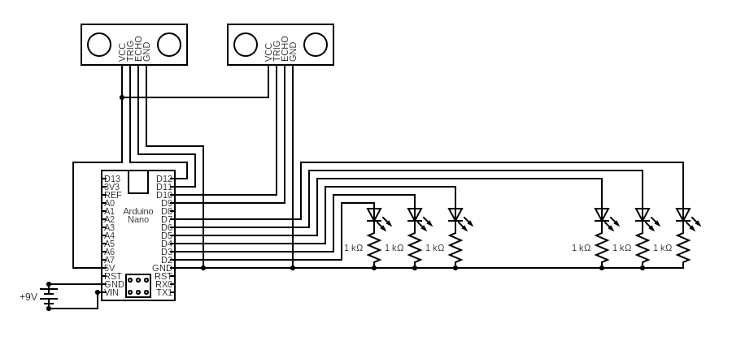

# Smart Traffic System

A personal exploration on implementing pedestrian-prioritised smart traffic
system in Arduino.

## Hardware Requirements

- ATmega328 Nano
- 9V battery
- 2 ultrasonic sensors (HC-SR04)
- Red, Yellow, Green LED (two each)
- 6 1 kΩ resistors

## Circuit Diagram

